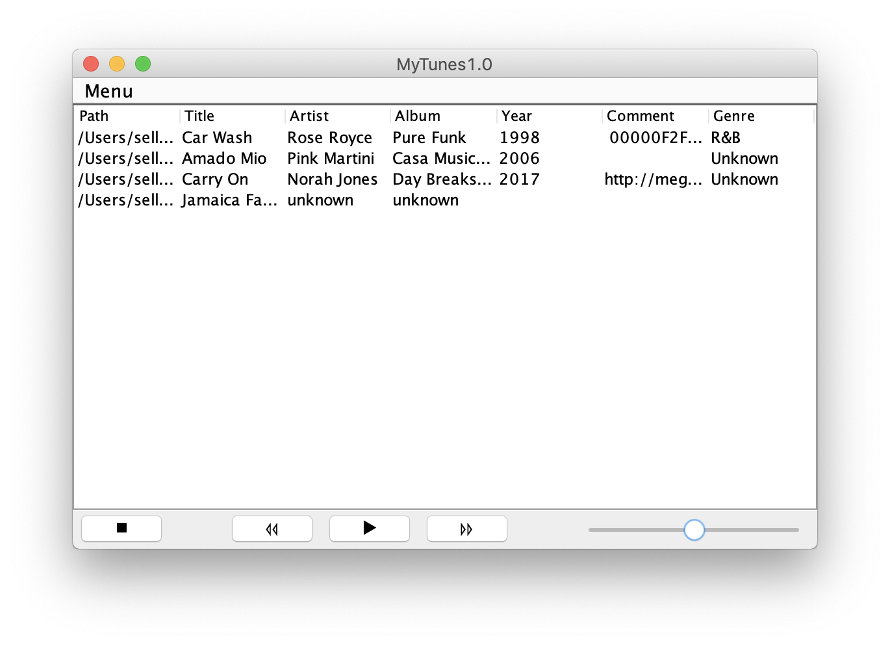

# MusicPlayer

Github repository for class CECS543 Spring 2019 at CSULB

* Language: Java 8
* Database: Derby 10.14
* Libraries
  * [BasicPlayer3](http://www.javazoom.net/jlgui/api.html) - [doc](http://www.it.uu.se/edu/course/homepage/devgui/vt07/material/api/basicplayer3.0/javazoom/jlgui/basicplayer/BasicPlayer.html)
  * [mp3agic](https://github.com/mpatric/mp3agic)

## Iteration #1
3/14/2019  
Screenshot:

UML Class Diagram: [here](documentation/UMLCaseDiagram_1.0.pdf)

## Iteration #2
4/16/2019  
Screenshot:

UML Class Diagram: [here]()